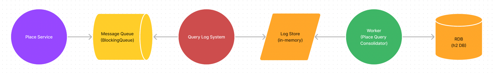
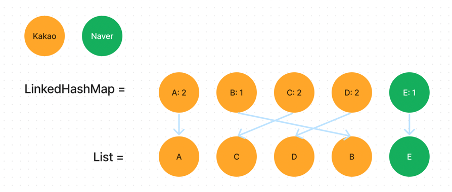

# Search

## 테스트 방법

1. 필요한 환경변수 값은 미리 세팅되어 있습니다. 바로 서버를 실행하실 수 있습니다.
2. API 요청은 인텔리제이를
   사용하신다면 [place-api.http](https://github.com/httpstatus200/search/blob/main/place-api.http) 에서
   테스트하실 수 있습니다. Intellij 환경이 아니시라면 아래 cURL 명령어를 활용하실 수 있습니다.
   > //주석에 첨부한 응답 결과는 시간이 지나 네이버, 카카오 응답 데이터 변경으로 바뀔 수 있습니다.
   >
   > // 빈쿼리  
   > curl -X GET --location "http://localhost:8080/v1/place?q="
   >
   > // 카카오 5, 네이버 5, 중복 3 (검색어: 국민은행 여의도)  
   > curl -X GET
   --location "http://localhost:8080/v1/place?q=%EA%B5%AD%EB%AF%BC%EC%9D%80%ED%96%89+%EC%97%AC%EC%9D%98%EB%8F%84"
   >
   > // 카카오 1, 네이버 3, 중복 1 (검색어: 밤비노아울렛)  
   > curl -X GET
   --location "http://localhost:8080/v1/place?q=%EB%B0%A4%EB%B9%84%EB%85%B8%EC%95%84%EC%9A%B8%EB%A0%9B"
   >
   > // 카카오 5, 네이버 4, 중복 1, 카카오 추가 요청으로 카카오 제공 데이터 6개 (검색어: 양양 양고기)  
   > curl -X GET
   --location "http://localhost:8080/v1/place?q=%EC%96%91%EC%96%91+%EC%96%91%EA%B3%A0%EA%B8%B0"
   >
   > // 카카오 1, 네이버 5, 중복 1, 네이버 추가 요청으로 네이버 제공 데이터 9개 (검색어: 안동 바버샵)  
   > curl -X GET
   --location "http://localhost:8080/v1/place?q=%EC%95%88%EB%8F%99+%EB%B0%94%EB%B2%84%EC%83%B5"
   >
   > // 인기 검색어 TOP 10, 비동기로 카운팅되고 있어요. (동기화 간격: 10s)  
   > curl -X GET --location "http://localhost:8080/v1/place/queries/top10"

## 시스템 디자인 요약


## 사용한 외부 라이브러리 및 오픈소스

### h2 database

사용 목적: 비휘발성 데이터를 저장할 데이터베이스가 필요했습니다. (개발 단계는 메모리 모드로 사용)  
선택 사유:

1) 요청한 쿼리를 카운팅한 데이터를 저장하기 위해 사용했습니다.
2) 잦은 업데이트가 발생하는 데이터를 저장해야 하므로 RDB를 사용했습니다.
3) 현재 개발 단계에서는 자바 애플리케이션에 임베드해서 사용할 수 있는 가벼운 오픈소스가 적합하다고 판단했습니다.
4) 클라이언트-서버 모드로 전환이 쉽고 추후 테스트용으로도 사용할 수 있습니다.

### ehcache3

사용 목적: DB I/O와 API 호출로 발생하는 Latency를 최소화 하기 위해 캐시가 필요했습니다.  
선택 사유:

1) 현재 개발 단계에서는 자바 애플리케이션에 임베드해서 사용할 수 있는 가벼운 오픈소스가 적합하다고 판단했습니다.
2) 사용하기 쉽고 레퍼런스가 많아서 빠르게 테스트해볼 수 있어서 사용했습니다.
3) 추후 다른 캐시로 전환해야 할 때 코드 변경을 줄이기 위해 `spring-boot-starter-cache`와 같이 사용할 수 있는 오픈소스가 필요했습니다.

### Lombock

사용 목적: 데이터 오브젝트를 작성할 때 반복해서 작성하는 코드양을 줄이기 위해서 사용했습니다.  
선택 사유: 많이 사용하고 있는 오픈소스로 검증되어 있기 때문입니다.

## 기술적 요구사항 구현

### 1) 키워드 검색 횟수

이슈: 요청한 쿼리를 API 요청마다 DB에서 `UPDATE table_name SET count = count + 1` 쿼리를 사용하여 데이터를 업데이트할 수 있습니다. 하지만
트래픽이 증가하면 Lock으로 인해 병목현상이 발생할 수 있습니다.

개선:  
앞서 공유한 아키텍처에서 키워드 검색 횟수를 반영하는 부분만 추출하면 이렇습니다.



1) 발생한 쿼리 로그를 메시지 큐에 전달합니다.
2) Query Log System 은 큐에서 로그를 받아 저장합니다.
3) 주기적으로 실행되는 워커에서 저장된 로그를 읽어서 키워드별로 카운팅 후 DB에 저장합니다.

이렇게 카운팅을 비동기로 처리하면 DB I/O 횟수를 줄이고 병목현상을 개선할 수 있습니다. 또한 저장된 로그를 활용할 수 있는 요구사항이 추가될 때 저장한 로그를 사용하여
기능 확장이 가능합니다. (e.g 날짜별 인기 검색어, 검색 로그 기록)

근데 여기서 `왜 로그를 메시지 큐와 쿼리 로그 시스템을 통해 저장하지?` 라는 의문이 생길 수 있습니다. 이유는 이렇습니다.

1) 현재 저장된 로그를 워커가 읽고 제거하기 때문에 동기화가 필요합니다.
2) Log Store I/O를 줄이기 위해서 필요합니다.

현재 로그는 메모리(List 자료구조)에 저장되고 있습니다. 그리고 워커는 이 로그를 읽고 카운팅하는 과정에서 읽은 로그를 제거합니다.
이때 데이터 유실이 발생할 수 있기 때문에 로그 저장과 추가 사이에 동기화가 필요합니다.

동기화를 위해 Lock을 사용합니다. 이때 API에서 직접 Store에 데이터를 추가한다면 Lock으로 인해 병목이 발생할 수 있습니다. 이런 동기화 처리를 다른 서비스에서
비동기로 처리하여 병목구간을 개선했습니다.

> 현재 구현상태는 로그를 메모리(List 자료구조)에 저장하고 있어서 Lock 때문에 병목이 발생할 가능성은 적습니다. 하지만 File System이나 캐시에 저장하는 걸 목표로
> 구현하고 있었기
> 때문에 먼저 이와 같은 구조를 구성했습니다.
>
> 실제 ehcache3에 저장하도록 로직을 임시로 변경해서 JMeter로 테스트했을때 아래 결과를 확인할 수 있었습니다.
>
> <직접 저장>
> 
>
> <비동기 저장>
> 
>
> 처리량(Throughput)을 보면 `14349.7/sec`와 `15594.3/sec`으로 성능에 영향을 줄 수 있는 점을 확인했습니다.

### 2) 새로운 검색 API 추가 시 변경 영역 최소화에 대한 고려

이슈: 새로운 검색 데이터 제공자(API)가 추가될 수 있습니다. 이때 변경을 최소화할 수 있는 방법이 필요합니다.

개선:  
두 가지 방법을 사용해서 변경을 최소화할 수 있게 했습니다.

- a) 외부 API와 비즈니스 로직 사이에 인터페이스를 사용해서 두 패키지 간에 의존도를 낮췄습니다.
- b) 정렬 로직을 API가 추가되는 상황에도 유연하게 작동하도록 작성했습니다.

각 내용을 이어서 자세히 설명하겠습니다.

#### a) 패키지 설계


이미지와 같이 비즈니스 로직이 외부 API 로직을 직접 참조하지 않게 설계했습니다. `interface PlaceSearch` 내용은 아래와 같습니다.

```java
public interface PlaceSearch {

    Mono<PlaceSearchResp> search(
        String query,
        int page,
        int size,
        MultiValueMap<String, String> params
    );
}
```

이렇게 설계하고 Google API를 추가할 때 예상 시나리오는 이렇습니다.

1) interface에 맞게 Google API 요청 클래스를 구현합니다.
2) 비즈니스 로직에서 Google API 세부 사항을 알필요 없이 호출할 수 있습니다. 데이터는 다른 API와 같은 포맷으로 받을 수 있게 됩니다.

#### b) 정렬 방식

비즈니스 로직 내에서도 다른 API가 추가되었을 때 유연하게 대응할 수 있도록 구현했습니다. 먼저 API 응답 데이터를 받습니다.


카카오는 `[A, B, C, D]`, 네이버는 `[A, C, D, E]`을 받았습니다. 이 데이터를 먼저 PriorityList를 활용해서 정렬된 리스로 만들어줍니다.
> PriorityList란?  
> `private static final ApiTypeEnum[] API_PRIORITY = {ApiTypeEnum.KAKAO, ApiTypeEnum.NAVER};`  
> API 우선순위를 관리하기 위해 클래스에 추가된 필드입니다. 낮은 인덱스가 높은 우선순위를 가집니다.


그리고 리스트를 순회하며 `LinkedHashMap`에 저장합니다. 이때 `LinkedHashMap`은 입력된 순서를 알고있기 때문에 우선순위를 기반으로
정렬된 순서를 유지할 수 있습니다.

데이터 저장은 데이터 중복여부를 확인하는 키를 만들어서 맵의 키로 사용하여 저장합니다. 만약 이미 같은 데이터가 들어있다면 추가하지 않고 카운트가 증가합니다.


그리고 중복 카운트를 기반으로 내림차순으로 정렬합니다.
> API가 추가되면 데이터 카운트가 2 이상일 수 있습니다. 이런 상황을 고려하여 정렬할 때 비교하는 두 데이터 카운트가 2 이상이라면 순서를 바꾸지 않도록 분기 처리가 되어
> 있습니다.  
> e.g) `{A: 1, B: 2, C:3}`를 정렬하면 `B-C-A`



이렇게 알고리즘을 구현했을때 비즈니스 로직에 외부 API를 추가하는 과정은 아래처럼 단순해집니다.

1) API 요청 로직을 추가한다.
2) PriorityList에 타입을 추가한다.

### 3) 캐시를 활용한 API 성능 개선

이슈: 트래픽이 증가하면 외부 API 호출과 DB 호출 횟수도 증가합니다. 그리고 API는 외부 서비스 처리 시간에 많은 영향을 받게 됩니다.

개선:  
검색과 인기 검색어 조회 API 모두 캐시를 적용했습니다.

#### a) 검색 API

검색 조회 결과는 캐시에 저장됩니다. 같은 쿼리로 재요청하면 캐시에서 데이터를 가져오기 때문에 외부 API 호출과 데이터 정렬을 하지 않아도 됩니다.
만약 유료 버전을 사용하고 있다면 비용을 아낄 수 있는 전략이기도 합니다.

#### b) 인기 검색어

인기 검색어를 조회하는 DB 쿼리는 데이터양이 많을수록 처리 비용이 커질 수 있습니다.


위 구조에서 워커는 주기적으로 DB 데이터를 캐싱합니다. 그리고 API는 캐시에 데이터가 존재한다면 캐시에서 데이터를 가져옵니다.

DB 요청이 줄어든 만큼 API 성능도 향상됩니다.